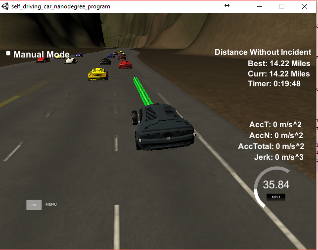

# CarND-Path-Planning-Project
Self-Driving Car Engineer Nanodegree Program
## By: Soroush Arghavan

### Path Generation



This model uses a state machine to determine the lane and the target velocity. As soon as data is available for processing, the data is passed to the state machine. The state machine has two states: cruise and lane changing. The state machine is in cruise state initially.

* Cruise state:
In cruise state, we simply go through the sensor fusion data and monitor the car in front of us. As soon as the distance between our car and the car in front is below a threshold, we go into Lane Change State.
* Lane Chang State
In this state, we first confirm if we are too close to the car in front. At the same time, we also look at cars in the right and left lanes to see if either of those lanes are safe to change to. Safety is determined by whether a car is within 10 units before or 50 units ahead of our car in the target lane. If we are too close and lanes are safe we start changing lanes. Left lane has priority over right lane. If we are too close but the lanes are not safe, we just reduce our speed to 35 mph and follow the car in front. In the case that the car in front is slower than 35 mph, we brake immediately.

Once the lane change has started, we only monitor the car in front of us in our current lane and our target lane. If we are too close to the car in front we brake. Lane changing is over when our car reaches the center of the target lane. In that case, the state machine switches back to cruise state and monitors the car in front.

Once the state machine has determined the lane and velocity, we start filling the waypoints. We start by using the remaining uncharted points from the previous time step. After that we convert our reference to the car rather than global coordinates. We take three points ahead for drawing a spline. The points are 30, 60 and 90 units in the "s" direction ahead of the car. Then we split the spline into parts .02*ref_vel/2.24 units apart which gives us just enough distance to not exceed the jerk and acceleration limits. Then we convert the points back to global coordinates and add these points to the next points as well. 

---

## Dependencies

* cmake >= 3.5
 * All OSes: [click here for installation instructions](https://cmake.org/install/)
* make >= 4.1
  * Linux: make is installed by default on most Linux distros
  * Mac: [install Xcode command line tools to get make](https://developer.apple.com/xcode/features/)
  * Windows: [Click here for installation instructions](http://gnuwin32.sourceforge.net/packages/make.htm)
* gcc/g++ >= 5.4
  * Linux: gcc / g++ is installed by default on most Linux distros
  * Mac: same deal as make - [install Xcode command line tools]((https://developer.apple.com/xcode/features/)
  * Windows: recommend using [MinGW](http://www.mingw.org/)
* [uWebSockets](https://github.com/uWebSockets/uWebSockets)
  * Run either `install-mac.sh` or `install-ubuntu.sh`.
  * If you install from source, checkout to commit `e94b6e1`, i.e.
    ```
    git clone https://github.com/uWebSockets/uWebSockets 
    cd uWebSockets
    git checkout e94b6e1
    ```